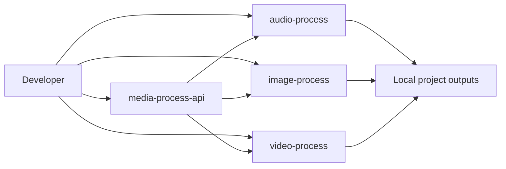

# Architecture Overview

## Repository model



Each media project remains independently runnable:

```text
CLI -> configuration -> orchestration
                         ├── generation provider
                         └── focused local utility
```

The API remains thin:

```text
HTTP route -> service -> existing CLI -> local output
```

## Generation providers versus operations

Providers represent interchangeable generation backends such as Bark or a future ComfyUI workflow.

Concrete transformations such as FFmpeg resize, subtitle writing, and background removal remain focused utility functions. Turning every operation into a provider would add abstraction without value.

## Output model

CLI users choose an output folder with `--output-dir`.

API users may provide a project name:

```text
media-process-api/outputs/<project>/audio/
media-process-api/outputs/<project>/image/
media-process-api/outputs/<project>/video/
```

## Dependency strategy

- base CLIs remain small
- FFmpeg is the shared system media tool
- faster-whisper is optional
- rembg is optional
- provider SDKs stay inside the project that needs them
- the API does not install every model dependency by default
