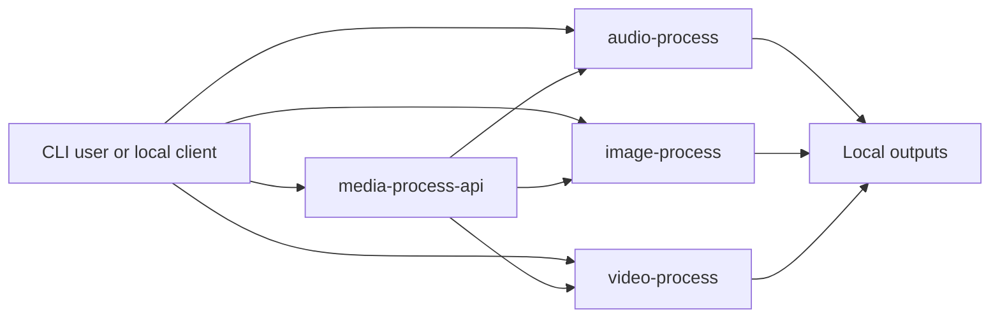

# Architecture Overview

## Repository model

The toolkit contains three independent media projects and one optional local API.



Each media project can still be opened, understood, and run on its own:

```text
CLI -> configuration -> orchestration -> provider -> output
                         |
                         -> media utilities
```

The API adds a thin HTTP path:

```text
HTTP route -> service -> existing media CLI -> provider -> shared API outputs
```

## Shared media project pattern

Each media project contains:

- `cli.py`: parses terminal commands, prints the final output path, and reports errors
- `config.py`: loads defaults and optional JSON configuration
- `main.py`: coordinates providers, retries, logging, and output paths
- `providers/`: contains the built-in demo provider and future integrations
- `utils/`: contains focused local helpers
- `examples/`: contains prompts and sample output metadata
- `outputs/`: stores generated files and is ignored by Git
- `docs/`: contains architecture and troubleshooting notes

## API pattern

`media-process-api` contains:

- `app/main.py`: creates FastAPI, mounts outputs, and registers routes
- `app/config.py`: loads minimal local server settings
- `app/models.py`: defines the small shared request and response models
- `app/routes/`: exposes one generation route per media type
- `app/services/`: translates requests into existing CLI calls
- `outputs/`: stores API-generated audio, image, and video artifacts

The API uses subprocesses because the existing projects have independent top-level module names and optional dependencies. This avoids a broad package refactor and keeps each project runnable on its own. See [the API architecture](../media-process-api/docs/architecture.md) for tradeoffs and the gradual in-process migration path.

## Provider boundary

A provider has one responsibility: accept a generation request and create an output. Neither the CLI nor the API route needs to know how the provider works.

A new provider normally requires:

1. one provider implementation
2. one provider registry entry in the media project
3. one metadata entry in the API provider catalog

No endpoint change is needed when the provider uses the existing request fields.

## Configuration

Normal media settings belong in JSON files because they are visible, portable, and easy to review. Environment variables are limited to configuration paths, secrets, and minimal API bootstrapping values such as host, port, timeout, and output location.

There is no database or Admin CMS in the current toolkit. Adding either would create unnecessary infrastructure for local development projects.

## Dependency strategy

The demo providers use only the Python standard library. The API installs only FastAPI, Uvicorn, and dotenv support. Large model libraries and provider SDKs remain optional and belong to the media project that uses them.
