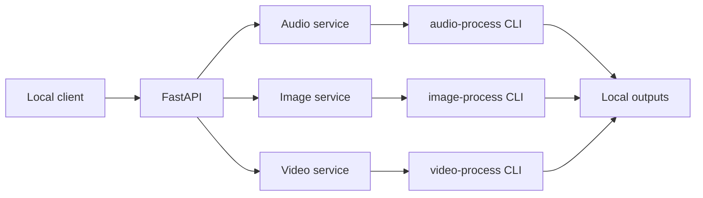

# Media Process API

A lightweight FastAPI server that exposes the repository audio, image, and video tools through one local HTTP API.

The API is intentionally small. It validates requests, invokes the existing media CLIs, and returns the generated file path and URL. Provider logic remains inside `audio-process`, `image-process`, and `video-process`.

## Why the API uses the existing CLIs

The three media projects are independent folders with their own configuration, providers, and optional dependencies. The API runs each CLI in a subprocess instead of duplicating that logic or forcing a large package refactor.

This provides useful isolation today:

- each media project remains independently runnable
- provider dependencies do not leak into the API
- one failing provider does not corrupt the API process
- adding the API does not reorganize existing files

A future phase can move selected local models in-process when persistent model loading becomes more important than isolation.

## Architecture



See [docs/architecture.md](docs/architecture.md) for the complete request flow and design tradeoffs.

## Folder structure

```text
media-process-api/
├── app/
│   ├── main.py
│   ├── config.py
│   ├── models.py
│   ├── routes/
│   │   ├── audio.py
│   │   ├── image.py
│   │   └── video.py
│   └── services/
│       ├── audio_service.py
│       ├── image_service.py
│       ├── video_service.py
│       ├── common.py
│       └── runner.py
├── outputs/
│   ├── audio/
│   ├── image/
│   └── video/
├── examples/
├── docs/
├── requirements.txt
├── .env.example
└── README.md
```

`models.py` is intentionally one file. A models package can be introduced only when the number of request and response models makes it useful.

## Requirements

- Python 3.10 or newer
- The repository must keep `media-process-api`, `audio-process`, `image-process`, and `video-process` beside each other
- FFmpeg only for audio conversion features used directly by `audio-process`
- Optional provider dependencies only when using providers such as Bark

The built-in demo providers work without a GPU or cloud account.

## Installation

```bash
cd media-process-api
python -m venv .venv
```

Activate the environment.

Windows PowerShell:

```powershell
.\.venv\Scripts\Activate.ps1
```

macOS or Linux:

```bash
source .venv/bin/activate
```

Install the API dependencies:

```bash
python -m pip install --upgrade pip
python -m pip install -r requirements.txt
```

Copy the optional environment file:

```bash
cp .env.example .env
```

Windows PowerShell:

```powershell
Copy-Item .env.example .env
```

The defaults work without creating `.env`.

## Configuration

| Variable | Default | Purpose |
| --- | --- | --- |
| `MEDIA_API_NAME` | `AI Media Processing Toolkit API` | OpenAPI title and root message |
| `MEDIA_API_HOST` | `127.0.0.1` | Local bind address |
| `MEDIA_API_PORT` | `8000` | Local server port |
| `MEDIA_API_LOG_LEVEL` | `INFO` | Python log level |
| `MEDIA_API_PROCESS_TIMEOUT` | `600` | Maximum seconds allowed for one media CLI call |
| `MEDIA_API_OUTPUT_DIR` | `media-process-api/outputs` | Shared local output directory |

Provider-specific settings remain in each media project. This keeps the API focused on transport and orchestration.

## Run the server

From `media-process-api`:

```bash
uvicorn app.main:app --reload
```

Open:

- API documentation: `http://127.0.0.1:8000/docs`
- Health check: `http://127.0.0.1:8000/health`
- Provider list: `http://127.0.0.1:8000/providers`
- Model list: `http://127.0.0.1:8000/models`

To use values from `config.py` without repeating the host and port:

```bash
python -m app
```

## API endpoints

| Method | Endpoint | Purpose |
| --- | --- | --- |
| `GET` | `/health` | Confirm the server is running |
| `GET` | `/providers` | List providers by media type |
| `GET` | `/models` | List known provider models or demo implementations |
| `POST` | `/audio/generate` | Generate an audio artifact |
| `POST` | `/image/generate` | Generate an image artifact |
| `POST` | `/video/generate` | Generate a video artifact or request manifest |

Generated files are also served from `/outputs/...`.

## Example requests

### Generate audio

```bash
curl -X POST http://127.0.0.1:8000/audio/generate \
  -H "Content-Type: application/json" \
  -d '{"prompt":"A calm notification tone","provider":"demo"}'
```

### Generate an image

```bash
curl -X POST http://127.0.0.1:8000/image/generate \
  -H "Content-Type: application/json" \
  -d '{
    "prompt":"A floating island above soft clouds",
    "negative_prompt":"blurry text",
    "provider":"demo"
  }'
```

### Generate a video artifact

```bash
curl -X POST http://127.0.0.1:8000/video/generate \
  -H "Content-Type: application/json" \
  -d '{"prompt":"A slow camera move through a neon city","provider":"demo"}'
```

More copy-ready examples are available in [examples/requests.http](examples/requests.http).

## Example response

```json
{
  "media_type": "image",
  "provider": "demo",
  "filename": "generated-floating-island-20260730-120000-a1b2c3.svg",
  "output_path": "/local/projects-xyz/media-process-api/outputs/image/generated-floating-island-20260730-120000-a1b2c3.svg",
  "output_url": "/outputs/image/generated-floating-island-20260730-120000-a1b2c3.svg"
}
```

The exact filename changes for every request.

## Adding a provider

1. Add the provider to the appropriate media project under `providers/`.
2. Register it in that project's `providers/__init__.py`.
3. Test it through the media CLI.
4. Add its name and model metadata to `PROVIDER_CATALOG` in `app/config.py`.
5. Call the existing API endpoint with the new provider name.

No route or service change is required when the provider uses the existing request fields.

See [docs/providers.md](docs/providers.md) for an example.

## Adding an endpoint

Add an endpoint only when it represents a new operation rather than a provider-specific variation.

1. Add or reuse a request model in `app/models.py`.
2. Keep the operation in the relevant media project where possible.
3. Add a small service function that invokes the media CLI.
4. Add the route and include it in `app/main.py`.
5. Add an example request and update this endpoint table.

## Development workflow

- Make changes on a `feat/<feature-name>` branch.
- Keep provider logic in the media projects.
- Keep HTTP validation and response formatting in this API.
- Test the media CLI first, then test the API endpoint.
- Do not add infrastructure until a current feature requires it.

See [docs/development.md](docs/development.md).

## Error handling

- FastAPI returns `422` for invalid request bodies.
- Media CLI failures return `422` with a readable `detail` message.
- A timed-out media process returns `422` and states the configured timeout.
- Unexpected server failures remain `500` errors so they are not silently hidden.

## Troubleshooting

See [docs/troubleshooting.md](docs/troubleshooting.md) for common path, dependency, timeout, and provider errors.

## Future improvements

- Add tested local image and video providers
- Add optional request fields only when providers need them
- Add job polling when a real asynchronous video provider is introduced
- Reuse loaded local models in-process when startup cost becomes a measured problem
- Add lightweight API tests during the stabilization phase
