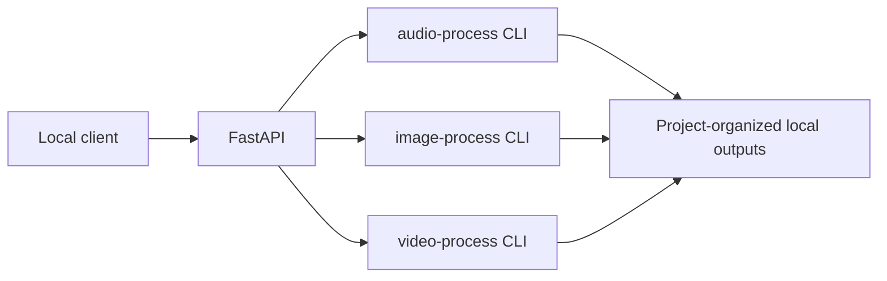

# Media Process API

A lightweight local FastAPI server for practical audio, image, and video workflows.

The API validates requests, invokes the existing media CLIs, and returns local output paths and URLs. Business logic stays inside the media projects.

## Why subprocess integration remains

- each media project stays independently runnable
- optional model dependencies remain isolated
- the API avoids duplicate provider logic
- one failed media command does not corrupt the server process
- no package reorganization is required

Selected providers can move in-process later if repeated model startup becomes a measured problem.

## Architecture



## Installation

Python 3.11 is recommended.

```bash
cd media-process-api
python -m venv .venv
source .venv/bin/activate  # Windows: .\.venv\Scripts\Activate.ps1
python -m pip install --upgrade pip
python -m pip install -r requirements.txt
```

Install optional practical features in the same environment:

```bash
python -m pip install -r ../audio-process/requirements-transcription.txt
python -m pip install -r ../image-process/requirements-background.txt
```

Install FFmpeg for audio enhancement and video processing.

## Run

```bash
uvicorn app.main:app --reload
```

Open:

- docs: `http://127.0.0.1:8000/docs`
- health: `http://127.0.0.1:8000/health`
- capabilities: `http://127.0.0.1:8000/capabilities`
- providers: `http://127.0.0.1:8000/providers`
- image presets: `http://127.0.0.1:8000/image/presets`

## Configuration

| Variable | Default | Purpose |
| --- | --- | --- |
| `MEDIA_API_NAME` | `AI Media Processing Toolkit API` | API title |
| `MEDIA_API_HOST` | `127.0.0.1` | local bind address |
| `MEDIA_API_PORT` | `8000` | server port |
| `MEDIA_API_LOG_LEVEL` | `INFO` | log level |
| `MEDIA_API_PROCESS_TIMEOUT` | `3600` | maximum seconds for one media command |
| `MEDIA_API_OUTPUT_DIR` | `outputs` | local output root |

The server is intended for local use. Do not expose it publicly without adding authentication and path restrictions.

## Endpoints

| Method | Endpoint | Purpose |
| --- | --- | --- |
| `GET` | `/health` | server status |
| `GET` | `/capabilities` | practical operations by media type |
| `GET` | `/providers` | generation providers |
| `GET` | `/models` | known provider models |
| `GET` | `/image/presets` | reusable prompt presets |
| `POST` | `/audio/generate` | generate audio |
| `POST` | `/audio/convert` | convert a local file to MP3 |
| `POST` | `/audio/normalize` | normalize loudness |
| `POST` | `/audio/enhance` | clean spoken audio |
| `POST` | `/audio/trim` | trim a local file |
| `POST` | `/audio/transcribe` | create TXT or SRT output |
| `POST` | `/image/generate` | generate one image |
| `POST` | `/image/generate-batch` | generate several images sequentially |
| `POST` | `/image/remove-background` | create transparent PNG |
| `POST` | `/video/generate` | create provider generation artifact |
| `POST` | `/video/resize` | resize and pad a local video |
| `POST` | `/video/frames` | extract frames and return a manifest |

## Project output grouping

Most requests accept an optional `project` field:

```json
{
  "input_path": "C:/media/episode-12.mp4",
  "output_format": "srt",
  "project": "episode-12"
}
```

The result is stored under:

```text
outputs/episode-12/audio/
```

The project value is converted into a safe folder name.

## API examples

### Generate subtitles

```bash
curl -X POST http://127.0.0.1:8000/audio/transcribe \
  -H "Content-Type: application/json" \
  -d '{
    "input_path":"C:/media/video.mp4",
    "output_format":"srt",
    "model":"small",
    "project":"episode-12"
  }'
```

### Enhance narration

```bash
curl -X POST http://127.0.0.1:8000/audio/enhance \
  -H "Content-Type: application/json" \
  -d '{"input_path":"C:/media/narration.wav","project":"episode-12"}'
```

### Batch game asset prompts

```bash
curl -X POST http://127.0.0.1:8000/image/generate-batch \
  -H "Content-Type: application/json" \
  -d '{
    "prompts":["forest guardian portrait","healing potion icon"],
    "preset":"pixel-art",
    "provider":"demo",
    "project":"forest-game"
  }'
```

### Remove a background

```bash
curl -X POST http://127.0.0.1:8000/image/remove-background \
  -H "Content-Type: application/json" \
  -d '{"input_path":"C:/media/character.png","project":"forest-game"}'
```

### Resize a vertical clip

```bash
curl -X POST http://127.0.0.1:8000/video/resize \
  -H "Content-Type: application/json" \
  -d '{"input_path":"C:/media/highlight.mp4","preset":"shorts","project":"episode-12"}'
```

### Extract reference frames

```bash
curl -X POST http://127.0.0.1:8000/video/frames \
  -H "Content-Type: application/json" \
  -d '{"input_path":"C:/media/gameplay.mp4","fps":1,"project":"forest-game"}'
```

More requests are in [examples/requests.http](examples/requests.http).

## Response

```json
{
  "media_type": "audio",
  "operation": "transcribe",
  "provider": null,
  "filename": "video-transcript.srt",
  "output_path": "C:/projects/projects-xyz/media-process-api/outputs/episode-12/audio/video-transcript.srt",
  "output_url": "/outputs/episode-12/audio/video-transcript.srt"
}
```

## Adding a provider

1. Implement and register it in the relevant media project.
2. Test it through that project's CLI.
3. Add its model metadata to `PROVIDER_CATALOG`.
4. Reuse the existing generation endpoint when request fields are unchanged.

## Adding an operation

1. Implement the operation in the relevant media project.
2. Add one request model only if existing models do not fit.
3. Add a small service function that calls the CLI.
4. Add one route and one example request.

## Error handling

- invalid request bodies return `422`
- missing files and optional dependencies return readable `422` details
- subprocess timeouts return `422`
- unexpected server errors remain `500`

## Troubleshooting

- Use absolute input paths, especially on Windows.
- Install optional requirements in the API virtual environment.
- Increase `MEDIA_API_PROCESS_TIMEOUT` for larger models or long videos.
- Confirm FFmpeg is available from the same terminal that starts the API.

See [docs/troubleshooting.md](docs/troubleshooting.md).
