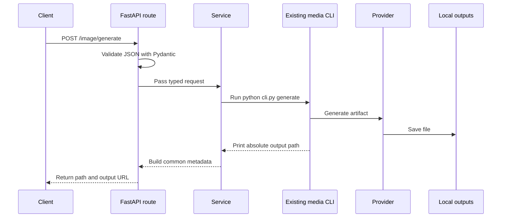

# Architecture

## Goal

Provide one local HTTP entry point without merging the three media projects into one large package.

## Request flow

## Responsibilities

### FastAPI application

- exposes routes
- validates requests
- serves generated files
- returns consistent errors
- lists known providers and models

### Media services

- translate API fields into CLI arguments
- select the correct output subdirectory
- build the common response

### Existing media projects

- load provider configuration
- select providers
- retry provider operations
- name output files
- generate or process media

## Why subprocesses

The current media folders use independent top-level imports and hyphenated directory names. Importing all three directly into one Python process would require a broader package refactor and could cause module-name collisions such as `config`, `providers`, and `utils`.

Subprocess execution is the smallest reliable boundary for the current repository. It also allows each media project to install optional provider dependencies independently.

## Current tradeoffs

- A local model is loaded again for each request.
- Progress is visible in provider logs rather than streamed to the caller.
- Provider metadata is listed explicitly in `app/config.py`.
- Video generation remains a request manifest until a real video provider is added.

These tradeoffs are acceptable for a development foundation. They should change only when real usage demonstrates a need.

## Future migration path

When repeated model loading becomes a measured bottleneck:

1. Convert one media project into an importable package using relative imports.
2. Keep its public orchestration function stable.
3. Replace only that service's subprocess call with an in-process call.
4. Keep the route and response model unchanged.

This allows gradual optimization without redesigning the API.
