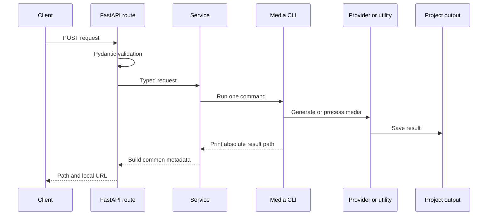

# Architecture

## Request flow



## Responsibilities

### API

- validate JSON
- expose discoverable endpoints
- translate failures into readable responses
- serve local outputs

### Services

- build CLI arguments
- choose project-organized output folders
- convert output paths into API responses

### Media projects

- own generation providers
- own FFmpeg, transcription, prompt, and background-removal logic
- validate input files
- write final artifacts

## Why local paths instead of uploads

The server is designed for one developer on one machine. Local paths avoid multipart dependencies and unnecessary file copies. This also makes large video workflows faster.

Do not expose the API publicly without adding authentication and path restrictions.

## Why subprocesses

The media projects use independent top-level modules and optional dependencies. Subprocesses preserve that structure and isolate model failures. Move a selected provider in-process only when model reload time becomes a measured issue.

## Output organization

```text
outputs/<project>/<media-type>/<artifact>
```

Without a project value, outputs remain under `outputs/<media-type>/`.
